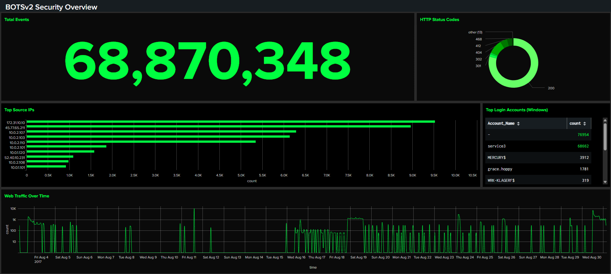

<!-- Replace bracketed placeholders with your real details before publishing. -->

# CASE-001 · SIEM Threat Detection & Dashboard Build

`Status: Documented` · `Category: Detection & Monitoring` · `Tools: Splunk Enterprise, BOTSv2 Dataset, SPL`

## Overview

This case covers standing up a working SIEM environment and learning to turn raw security logs into actionable monitoring. The lab uses **BOTSv2 (Boss of the SOC v2)** — a publicly available dataset built by Splunk for SOC training, containing logs from a simulated breach against a fictional brewing company ("Frothly"). It includes a mix of Windows event logs, network/wire data, and endpoint telemetry, which makes it realistic enough to practice real detection workflows on.

## Lab Environment

| Component | Detail |
|---|---|
| SIEM Platform | Splunk Enterprise 4.78.0 |
| Dataset | BOTSv2 |
| Indexes Used | `botsv2` |
| Key Sourcetypes | `[e.g., WinEventLog:Security, stream:http, suricata]` |
| Deployment | Docker |

## Methodology

1. **Ingest & orient** — loaded the BOTSv2 dataset into Splunk and ran broad searches (`index=botsv2`) to understand what sourcetypes and fields were available before writing any targeted queries.
2. **Hunt with SPL** — wrote searches to surface indicators of compromise across the simulated environment.
3. **Build dashboards** — translated the most useful searches into permanent dashboard panels: time charts for activity volume, tables for top talkers/users, and single-value panels for at-a-glance health checks.
4. **Rehearse the demo** — practiced presenting the dashboard live, narrating what each panel shows and why it matters to someone without a security background.

## Key SPL Queries

> Replace these with your actual queries and a one-line note on what each one is hunting for.

```spl
# Counting events by sourcetype to see overall log volume across the dataset
index=botsv2 sourcetype=*
| stats count by sourcetype
| sort -count

# Visualizing how event volume changes over time across the dataset, broken down by sourcetype
index=botsv2
| timechart span=1h count by sourcetype
```

## Findings

- Discovered that `mysql:server:stats` and `mysql:transaction:details` were by far the highest-volume sourcetypes in the dataset (~13.5M+ events each), indicating heavy database activity logging — far outweighing security-specific sourcetypes like `wineventlog:security` (424,715 events).
- The hourly timechart revealed that log volume was extremely concentrated rather than continuous — the vast majority of hourly windows showed zero events across most sourcetypes. Two sharp spikes stood out: **2017-08-03 18:00**, where infrastructure sourcetypes like `mysql:server:stats` (187,885), `mysql:transaction:details` (187,797), `collectd` (166,162), and `winregistry` (149,277) all surged simultaneously, and a smaller repeat of the same pattern at **2017-08-05 08:00**. This suggests these sourcetypes are generated by periodic scheduled jobs or scripted data collection rather than continuous real-time logging — a useful distinction when deciding which sourcetypes to rely on for time-sensitive security monitoring versus batch/reporting purposes.

## Dashboard

*Dashboard summarizing overall event volume, HTTP status codes, top talking IPs, top login accounts, and web traffic trends across the BOTSv2 environment.*

## Skills Demonstrated

- SPL query writing (search, stats, timechart, eval)
- Log correlation across multiple sourcetypes
- Dashboard and visualization design
- Translating technical findings for a non-technical audience

## Reflection
The hardest part of this case was getting comfortable with SPL syntax itself — understanding how commands like `stats`, `timechart`, and `sort` pipe into each other to transform raw events into something readable took more trial and error than I expected. With more time, I'd spend additional time deliberately practicing SPL fundamentals (filtering, field extraction, eval expressions) before jumping into dashboard building, since a stronger grasp of the query language would have made every later step faster and more confident.
