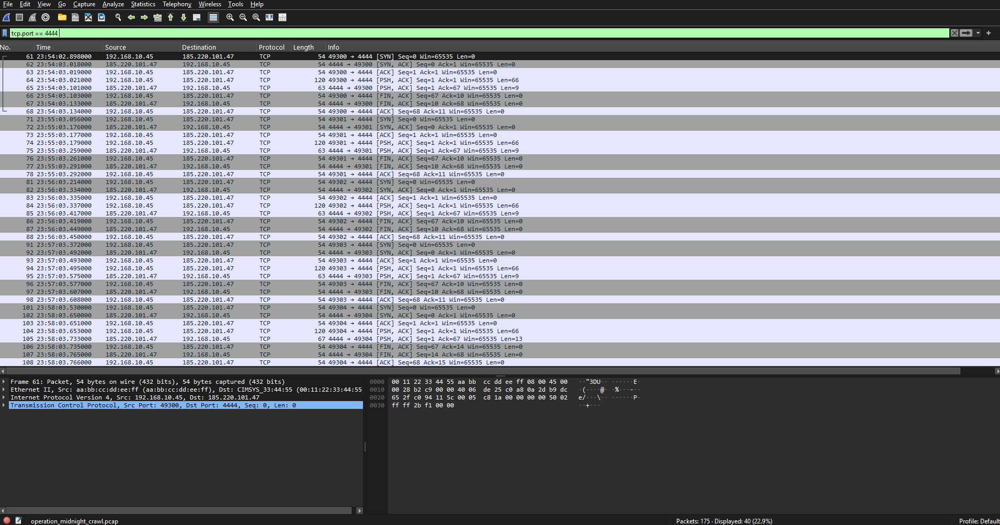

<!-- Replace bracketed placeholders with your real details before publishing. -->

# CASE-003 · Network Traffic & Packet Analysis

`Status: Documented` · `Category: Network Forensics` · `Tools: Wireshark`

## Overview

Most SOC tooling eventually points back to "go look at the packets." This case is about building that habit directly — capturing and reading raw network traffic in Wireshark instead of relying on automated alerts or summary reports. By analyzing a suspicious host's traffic patterns, I identified reconnaissance activity, command-and-control beaconing, and data exfiltration — demonstrating how packet-level analysis is essential for confirming and understanding security incidents.

## Lab Environment

| Component | Detail |
|---|---|
| Capture Tool | Wireshark 4.6.6 |
| Capture Source | Operation Midnight Crawl Packet Analysis |
| Objective | Captured traffic from a single internal host following an alert for suspicious outbound activity, in order to investigate possible malware C2 communication. |

## Methodology

1. **Orient with protocol hierarchy** — opened each capture and reviewed *Statistics → Protocol Hierarchy* before drilling into individual frames, to understand the overall traffic mix first.
2. **Filter with intent** — used display filters to isolate specific conversations and patterns rather than scrolling raw captures.
3. **Follow the stream** — reconstructed full TCP/HTTP sessions using *Follow → TCP Stream* to see what actually happened end-to-end, not just that a connection occurred.
4. **Baseline vs. anomaly** — compared a capture of "normal" traffic against a capture with suspicious activity to build a feel for what should draw attention.

## Key Filters Used

```
# Isolate all traffic to/from the victim host
ip.addr == 192.168.10.45

# Spot potential port-scan behavior (SYN without ACK)
tcp.flags.syn==1 && tcp.flags.ack==0

# Surface DNS queries to check for suspicious or randomly-generated domains
dns

# Isolate large outbound transfers from the victim host (possible data exfiltration)
ip.src == 192.168.10.45 and tcp.len > 1000

# Inspect traffic on a non-standard port for C2 activity
tcp.port == 4444
```

## Findings
- Identified a reconnaissance port scan from `45.77.103.22`, which sent SYN packets to 20 different ports against the victim host, with ports 80 and 445 responding SYN-ACK (confirmed open).
- Detected C2 beaconing behavior from the victim host to `185.220.101.47` over port 4444, with connections recurring at a consistent ~60-second interval — a strong indicator of active malware communication.
- Found evidence of data exfiltration: approximately 64,000 bytes were sent from the victim host to `185.220.101.47` over port 443 with virtually no inbound response, alongside DNS queries to two suspicious domains with random subdomain patterns.

## Screenshots

[](./screenshots/capture-overview.png)
*Filtered view (`tcp.port == 4444`) showing recurring beacon traffic from the victim host to 185.220.101.47 at ~60-second intervals, with the decoded payload confirming C2 communication.*

## Skills Demonstrated

- Packet and protocol analysis
- Wireshark display filter syntax
- TCP stream reconstruction
- Traffic baselining and anomaly identification

## Reflection

The SYN-without-ACK filter (`tcp.flags.syn==1 && tcp.flags.ack==0`) took the longest to get right — understanding *why* that specific combination of flags indicates a scan, rather than just memorizing it, changed how I approach Wireshark filters overall. Now I think about what I'm trying to observe (in this case, incomplete handshakes typical of reconnaissance) and build the filter from that intent rather than copying examples.
