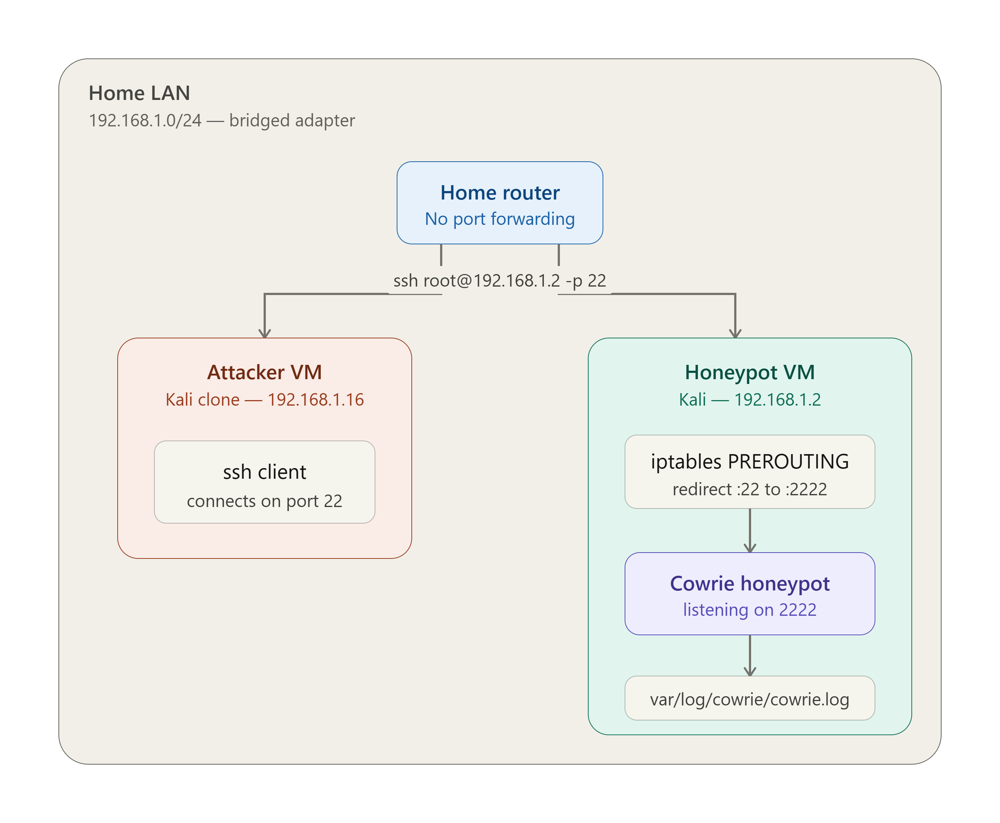

<!-- Replace bracketed placeholders with your real details before publishing. -->

# CASE-004 · Honeypot Deployment & Threat Intelligence

`Status: Documented` · `Category: Adversary Intelligence` · `Tools: Kali Linux, Cowrie, Home Lab`

## Overview

A honeypot gives a firsthand, unfiltered look at what automated attackers actually do — without putting real systems at risk. This case covers deploying one inside an isolated home lab segment and a[...] 

## Lab Environment

| Component | Detail |
|---|---|
| Host OS | Kali Linux 2026.1 |
| Honeypot Software | Cowrie |
| Virtualization | VirtualBox |
| Network Isolation | Bridged Adapter |
| Exposure | Exposed only within the lab network |

## Network Diagram

*The honeypot was isolated on a bridged-adapter LAN segment shared only 
by the attacker and victim VMs, with no router port-forwarding — keeping 
it reachable from the local network only, never the public internet. 
On the victim VM, an iptables rule redirected inbound port 22 traffic 
to Cowrie's listener on port 2222 for logging.*

## Methodology

1. **Isolate first** — built a dedicated network segment so the honeypot could be exposed without any path back to personal devices or data.
2. **Deploy & configure** — installed and configured Cowrie on Kali Linux to passively log connection attempts, credentials tried, and any commands executed by a connecting party.
3. **Let it run** — left the honeypot live for [duration] to collect a realistic sample of automated scanning/attack traffic.
4. **Analyze the logs** — reviewed honeypot logs for patterns: common usernames/passwords attempted, source IP behavior, scanning cadence, and any follow-on actions after a simulated "successful" login.
5. **Cross-reference with packets** — correlated honeypot application-layer logs against the matching Wireshark capture (see [CASE-003](../03-wireshark-traffic-analysis)) to connect what was logged at the application layer with what was actually observed on the wire.

## Findings

- Validated end-to-end functionality: a simulated login (root/kali) from the 
  attacker VM was correctly intercepted via iptables port redirection (22 → 2222), 
  authenticated by Cowrie's fake SSH service, and fully logged, including 
  source IP, credentials used, client SSH version, and HASSH fingerprint.

- Confirmed the honeypot's transparent redirect: the connection log shows the 
  session reaching Cowrie on its actual listening port (2222) despite the 
  attacker targeting standard SSH (port 22), proving the iptables rule 
  correctly disguises the honeypot as a normal SSH service.

- Because the lab was intentionally isolated, no real internet-sourced scanning traffic reached the 
  honeypot. This was a deliberate safety tradeoff, a production/research 
  deployment on a public-facing host would be needed to observe genuine 
  credential-stuffing patterns, scan cadence, and source IP/ASN distribution.

## Skills Demonstrated

- Honeypot deployment and configuration
- Network segmentation and isolation design
- Log analysis and pattern recognition
- Correlating application-layer and network-layer evidence

## Reflection
Setting up Cowrie made the mechanics of an SSH attack concrete in a way 
reading about them never does, watching a single login attempt get 
silently redirected from port 22 to the honeypot and fully logged, 
credentials and all, showed how little friction there is for an attacker 
once a service is exposed. Since the lab stayed isolated with no real 
internet traffic, the main limitation was scale: next, I'd run it 
internet-facing for a longer window to see genuine scanning behavior, 
and add a second honeypot type to compare attack patterns across services.
